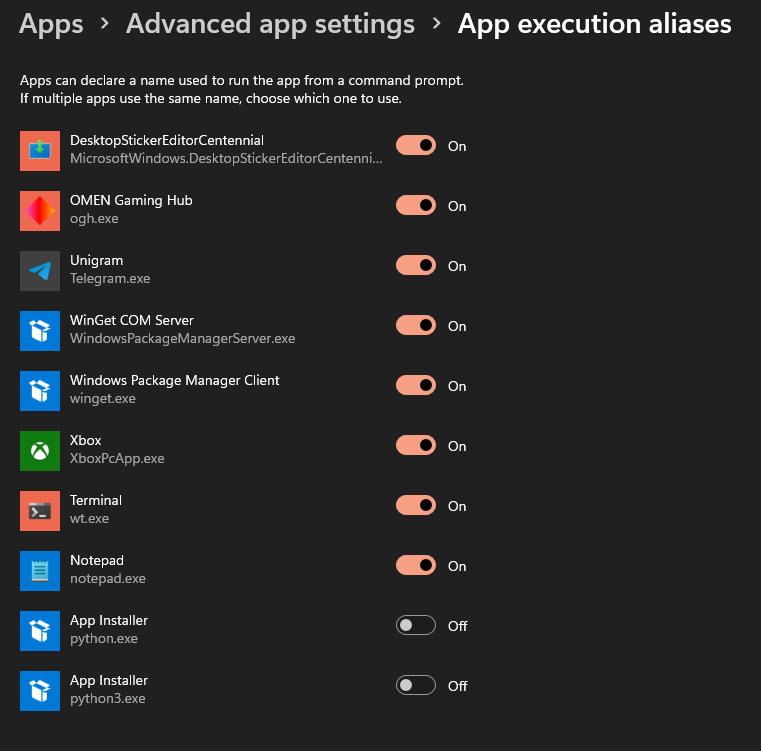

# Python Version Manager

Python Version Manager (PVM for short) is a project that has been inspired by [nvm for windows](https://github.com/coreybutler/nvm-windows) and aims to easily manage multiple python enviroments on your windows system.

# Table of contents

- [Python Version Manager](#python-version-manager)
- [Table of contents](#table-of-contents)
- [How to use](#how-to-use)
	- [Install](#install)
	- [Uninstall](#uninstall)
- [Developing](#developing)
	- [Get started](#get-started)
- [FAQ](#faq)
		- [Why reinvent the wheel when pyenv-win exists and does the same thing?](#why-reinvent-the-wheel-when-pyenv-win-exists-and-does-the-same-thing)
		- [What do I have to do if I encounter this error? `Python was not found; run without arguments to install from the Microsoft Store, or disable this shortcut from Settings > Manage App Execution Aliases.`](#what-do-i-have-to-do-if-i-encounter-this-error-python-was-not-found-run-without-arguments-to-install-from-the-microsoft-store-or-disable-this-shortcut-from-settings--manage-app-execution-aliases)

# How to use

This is a CLI application, so you need to open a terminal and use it from there.

## Install

At the moment it is available only as a portable version and the installation process is not too complex:

1. Download the latest version [from here](https://github.com/Relepega/PythonVersionManager/releases).
2. Unzip the app where you won't move it never again until you uninstall it.
3. Open a command prompt and navigate to the folder where you extracted PVM and run the command `pvm install pvm`.
4. Wait until you see the successful installation message and then close the terminal.
5. Reopen the terminal, type `pvm` and press enter. If the installation was successful then you will see an output like in [this image](#python-version-manager).
6. On Windows 11, open the `Settings` app and navigate to: `Apps` -> `Advanced app settings` -> `App execution aliases`, then turn off all the entries that have `python` or `python.exe`. Like in [this image](#what-do-i-have-to-do-if-i-encounter-this-error-python-was-not-found-run-without-arguments-to-install-from-the-microsoft-store-or-disable-this-shortcut-from-settings--manage-app-execution-aliases). Profit!
7. Profit 🎉!

Please keep in mind that you must install the app for each user you want to use it with.

## Uninstall

It's basically the same process as the installation one:

1. Open the app folder.
2. Open a command prompt and navigate to the folder where you extracted PVM and run the command `pvm uninstall pvm`.
3. Wait until you see the successful uninstallation message and then close the terminal.
4. Reopen the terminal, type `pvm -h` and press enter. If pvm was uninstalled successfully now in the terminal you should see an error.
5. Profit 🎉!
6. (optional) On Windows 11, open the `Settings` app and navigate to: `Apps` -> `Advanced app settings` -> `App execution aliases`, then turn on all the entries that have `python` or `python.exe`. Like in the [this image](#what-do-i-have-to-do-if-i-encounter-this-error-python-was-not-found-run-without-arguments-to-install-from-the-microsoft-store-or-disable-this-shortcut-from-settings--manage-app-execution-aliases). Profit!
7. (optional) Please let me know why you decided to uninstall pvm: fill [this form](https://github.com/Relepega/PythonVersionManager/issues/new) and i'll be here to read your struggles with pvm.

Please keep in mind that you must uninstall the app for each user you want to use it with.

# Developing

Any type of contribution is well accepted, just create a PR and i'll review it as soon as possible!

## Get started

1. Make sure to have these tools installed on your system

- Go 1.21.0 (minimum required version)
- Git
- GNU Make

2. When you're sure that you have installed them correctly, proceed by cloning the repository

`$ git clone https://github.com/Relepega/PythonVersionManager.git`

3. Hop into the project directory

`$ cd pvm`

4. Install the dependencies

`$ GO111MODULE=on go mod get all ./...`

5. You're now ready to go! If you want to build from source because you don't trust some random guy on the internet, run the build script:

`make build`

# FAQ

### Why reinvent the wheel when [pyenv-win](https://github.com/pyenv-win/pyenv-win) exists and does the same thing?

Forgive my ignorance, but i didn't know of its existence until the creation of this project.

### What do I have to do if I encounter this error? `Python was not found; run without arguments to install from the Microsoft Store, or disable this shortcut from Settings > Manage App Execution Aliases.`

On Windows 11, open the `Settings` app and navigate to: `Apps` -> `Advanced app settings` -> `App execution aliases`, then turn off all the entries that have `python` or `python.exe`. Like in the photo. Profit!

