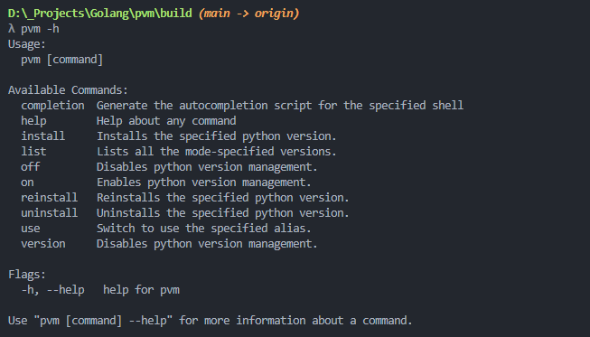

# Python Version Manager

Python Version Manager (PVM for short) is a project that has been inspired by [nvm for windows](https://github.com/coreybutler/nvm-windows) and aims to easily manage multiple python enviroments on your windows system.

# Table of contents

- [Python Version Manager](#python-version-manager)
- [Table of contents](#table-of-contents)
- [How to use](#how-to-use)
	- [Install](#install)
	- [Uninstall](#uninstall)
	- [Commands](#commands)
		- [install](#install-1)
		- [reinstall](#reinstall)
		- [uninstall](#uninstall-1)
		- [use](#use)
		- [list](#list)
		- [on](#on)
		- [off](#off)
		- [help](#help)
		- [version](#version)
- [Developing](#developing)
	- [Get started](#get-started)
- [FAQ](#faq)

# How to use

This is a CLI application, so you need to open a terminal and use it from there.

## Install

At the moment it is available only as a portable version and the installation process is not too complex:

1. Download the latest version [from here](https://github.com/Relepega/PythonVersionManager/releases).
2. Unzip the app where you won't move it never again until you uninstall it.
3. Inside the app folder, go to the subfolder `scripts`, right-click on `install.bat` and then click on `Run as administrator`. If the UAC kicks in, please click on `yes`.
4. Wait until you don't see any flying terminal and then close the folder.
5. Restart your terminal.
6. Type `pvm -h` and press enter. If the installation was successful then you will see an output like in [this image](#python-version-manager).
7. Profit 🎉!

Please keep in mind that you must install the app for each user you want to use it with. 

## Uninstall

It's basically the same process as the installation one:

1. Open the app folder.
2. Go to the `scripts` subfolder, right-click on `uninstall.bat` and then click on `Run as administrator`. If the UAC kicks in, please click on `yes`.
3. Wait until you don't see any flying terminal and then close the folder.
4. Restart your terminal.
5. Type `pvm -h` and press enter. If pvm was uninstalled successfully now in the terminal you should see an error.
6. Profit 🎉!
7. (optional) Please let me know why you decided to uninstall pvm: fill [this form](https://github.com/Relepega/PythonVersionManager/issues/new) and i'll be here to read your struggles with pvm.

Please keep in mind that you must uninstall the app for each user you want to use it with. 

## Commands

Here's a description of each command supported by the application:

### install

Installs the requested version. If you type the wrong version nothing will happen.

`$ pvm install latest` Installs the latest stable python version (currently it is 3.11.3).

`$ pvm install 3.11.0` Installs python 3.11.0.

Aliases: `install`, `--install`, `i`, `-i`

### reinstall

Uninstalls and then installs the specified version again. If you type the wrong version nothing will happen.

`$ pvm reinstall all` Reinstalls ALL the installed python versions.

`$ pvm reinstall 3.11.0` Reinstalls python 3.11.0.

Aliases: `reinstall`, `--reinstall`, `r`, `-r`

### uninstall

Uninstalls the specified version. If you type the wrong version nothing will happen.

`$ pvm uninstall all` Uninstalls ALL the installed python versions. Be careful with this one...

`$ pvm uninstall 3.11.0` Unistalls python 3.11.0.

Aliases: `uninstall`, `--uninstall`, `u`, `-u`

### use

No alias for this one.

If already downloaded, it activates the requested version.

`$ pvm use 3.11.0`

Aliases: `use`, `--use`

### list

Displays the requested info to the user.

`$ pvm list latest` lists all the latest python releases.

`$ pvm list all` lists all the available python versions.

`$ pvm list installed` lists all the currently installed versions.

Aliases: `list`, `--list`, `l`, `-l`

### on

`$ pvm on` Activates managed versions.

### off

`$ pvm off` Deactivates managed versions.

### help

Shows in the console what is written here. You can see it in action in the image [here](#python-version-manager).

Aliases: `help`, `--help`, `h`, `-h`

### version

Shows in the console the debug info of the app.

Aliases: `version`, `--version`, `v`, `-v`

# Developing

Any type of contribution is well accepted, just create a PR and i'll review it as soon as possible!

## Get started

1. Make sure to have these tools installed on your system

- Go 1.21.0 (minimum required version)
- Git

2. When you're sure that you have installed them correctly, proceed by cloning the repository

`$ git clone https://github.com/Relepega/PythonVersionManager.git`

3. Hop into the project directory

`$ cd pvm`

4. Export the `GO111MODULE` Enviroment Variable to ensure all modules to be installed correctly

- On Linux/MacOS: `$ export GO111MODULE=on`
- On Windows: `> set GO111MODULE=on`

5. Install the dependencies

`$ go mod download`

6. You're now ready to go! If you want to build from source because you don't trust some random guy on the internet, run the build script:

`build.bat`

# FAQ

Q: Why reinvent the wheel when [pyenv-win](https://github.com/pyenv-win/pyenv-win) exists and does the same thing?

A: Forgive my ignorance, but i didn't know of its existence until the creation of this project.
